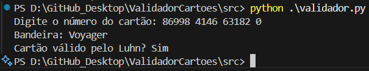

# Validador de Bandeiras de Cartões de Crédito

Valide números de cartões de crédito e identifique a bandeira (Visa, MasterCard, Elo, etc) de forma simples e rápida via linha de comando utilizando o algoritmo de Luhn.

<!-- Badges (opcional) -->


## 📑 Tabela de Conteúdos
- [Demonstração](#demonstração)
- [Instalação](#instalação)
- [Uso](#uso)
- [Funcionalidades](#funcionalidades)
- [Configuração](#configuração)
- [Contribuição](#contribuição)
- [Licença](#licença)
- [Autores](#autores)

## 🖼️ Demonstração

<p align="center">

</p>

## 🚀 Instalação

1. Clone o repositório:
```bash
git clone https://github.com/Naygno/ValidadorCartoes.git
```
2. Acesse a pasta do projeto:
```bash
cd ValidadorCartoes
```
3. Instale as dependências:
```bash
pip install -r requirements.txt
```

## 🎛️ Uso

Para validar um número de cartão e identificar a bandeira, dentro da pasta src, execute o seguinte comando:

```bash
python validador.py <número_do_cartão>
```

Substitua `<número_do_cartão>` pelo número do cartão que deseja validar.

## ⚙️ Funcionalidades

- Validação de números de cartões de crédito.
- Identificação da bandeira do cartão.
- Interface de linha de comando simples e intuitiva.

## 🔧 Configuração

- Certifique-se de ter o Python 3.8 ou superior instalado.
- Instale as dependências necessárias conforme descrito na seção de instalação.

## 🤝 Contribuição

Contribuições são bem-vindas! Sinta-se à vontade para enviar pull requests ou relatar problemas.

## 📄 Licença

Este projeto está licenciado sob a Licença MIT. Veja o arquivo [LICENSE](LICENSE) para mais detalhes.

## 👥 Autores

- **Naygno Barbosa Noia** - *Desenvolvedor Principal* - [Naygno](https://github.com/Naygno)

## 📝 Observações

Este projeto foi desenvolvido com o auxílio do GitHub Copilot, que forneceu sugestões automáticas de código e documentação durante o processo de desenvolvimento.

---

⌨️ por [Naygno Barbosa Noia](https://github.com/Naygno)